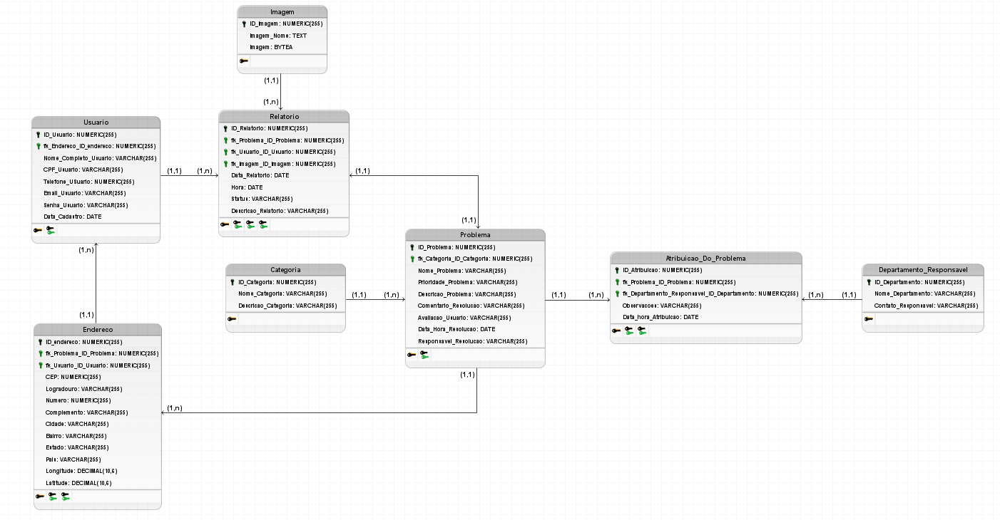

<h2>Reclama São Leopoldo</h2>

Integrantes: Arthur Vargas Lima, Bruno Garcia Guerreiro, Eduardo Sanhudo Fukui e Matheus Medtler 

<h1> Descrição <h1>

Este projeto tem como fundamento a criação de um sistema inovador que procura favorecer a comunidade local de São Leopoldo, Rio Grande do Sul. O sistema consiste na criação de um site capaz de mostrar e registrar problemas públicos, que utiliza os usuários da comunidade para popularizar o software

# Diagrama ER:

<h1>Link do KanBan (Metodologia Agil)</h1>
https://miro.com/welcomeonboard/amhyQ0RHZWc5MHVIR1R5Rk0wNm9TeDlBcDIvd1ZxakZWKzFYUjBYN2xWNU1xMUpralo3UEVsdlpPWHZ3czZ1NHRIVW1IOFoyYlpOOGZ0ek9BeUlrTWFublNYYk4wOVFhbGJHZHNxdVU5SmpkczNqZlhpN01sZkJUNGxYRzFNTG9hWWluRVAxeXRuUUgwWDl3Mk1qRGVRPT0hdjE=?share_link_id=596276630291

<h1>Link do Figma</h1>
https://www.figma.com/proto/STkE0KgkTXYoKetxjM3h93/Untitled?node-id=0-1&t=VPl3c0ZoN8eSNbeS-1
