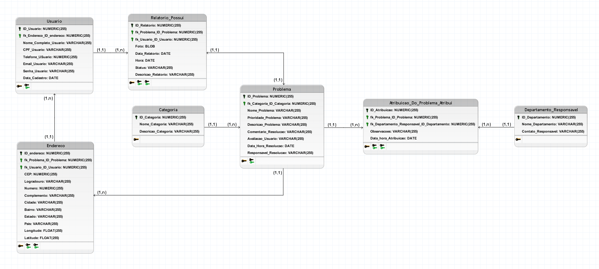

<h1>Reclama São Leopoldo</h1>

Este projeto tem como fundamento a criação de um sistema inovador que procura favorecer a comunidade local de São Leopoldo, Rio Grande do Sul. O sistema consiste na criação de um site capaz de mostrar e registrar problemas públicos, que utiliza os usuários da comunidade para popularizar o software

# Diagrama ER:

